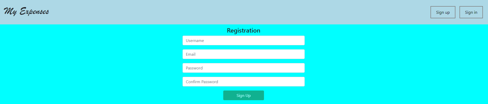
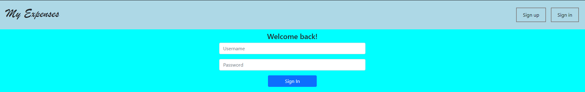
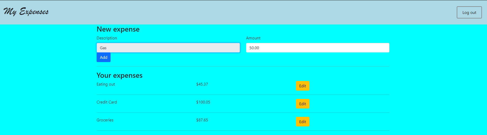
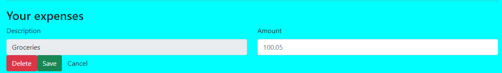
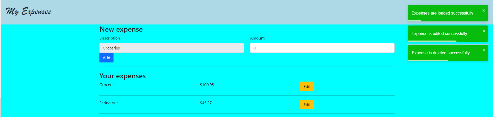

## :eyeglasses: Repository Introduction
**Expenses** is a web application made with ASP.NET 5 and ReactJS.
It supports User authentication and CRUD operations over the expenses of the logged user.
This application is ispired by the [YouTube chanel](https://www.youtube.com/channel/UC33AgVUaeocIhK0k6lpjXuw) of [Mr. Asiel Alvarez](https://www.linkedin.com/in/asiel-alvarez-760289172/).

:mag_right: Idea
1. Sign Up

2. Sign In

3. Home page, Expenses list

4. Edit expense or delete expense

5. Notifications

