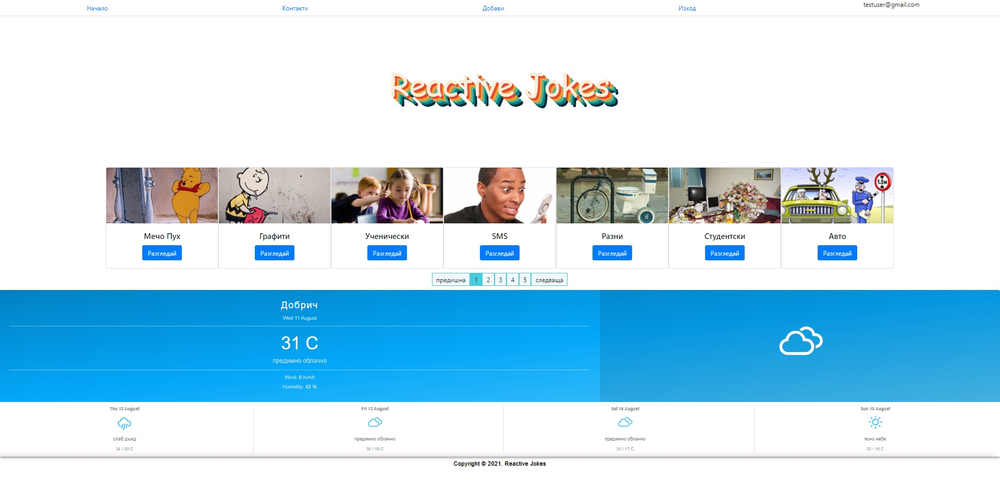
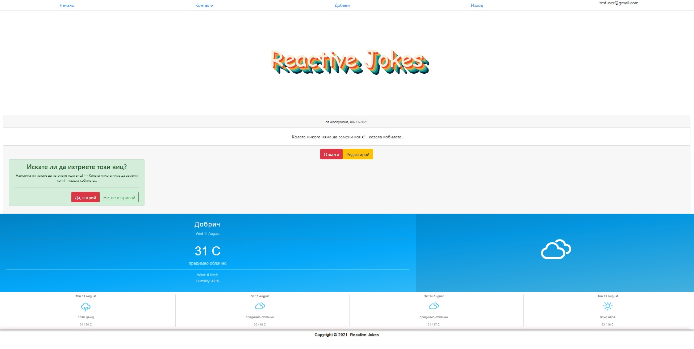

## :eyeglasses: Repository Introduction
**Reactive-Jokes** is a web application made with ASP.NET 5 and ReactJS.
It supports User authentication and CRUD operations over jokes and joke categories.
This application is done as a part of a student project and has limited functionalities.
The main purpose of it to show how to connect server and client.

:mag_right: Idea
1. Joke categories

2. Edit joke

